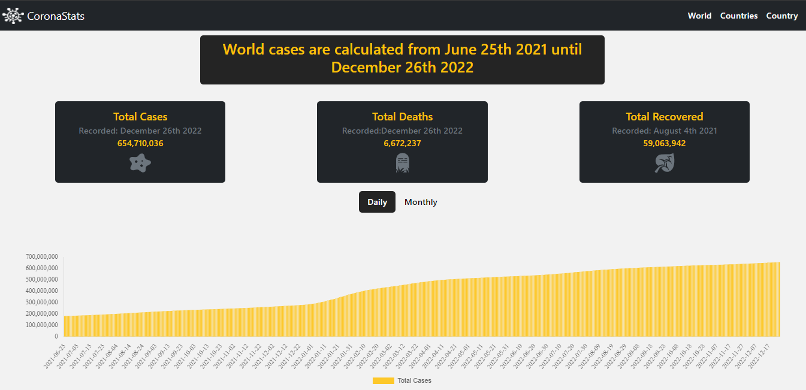
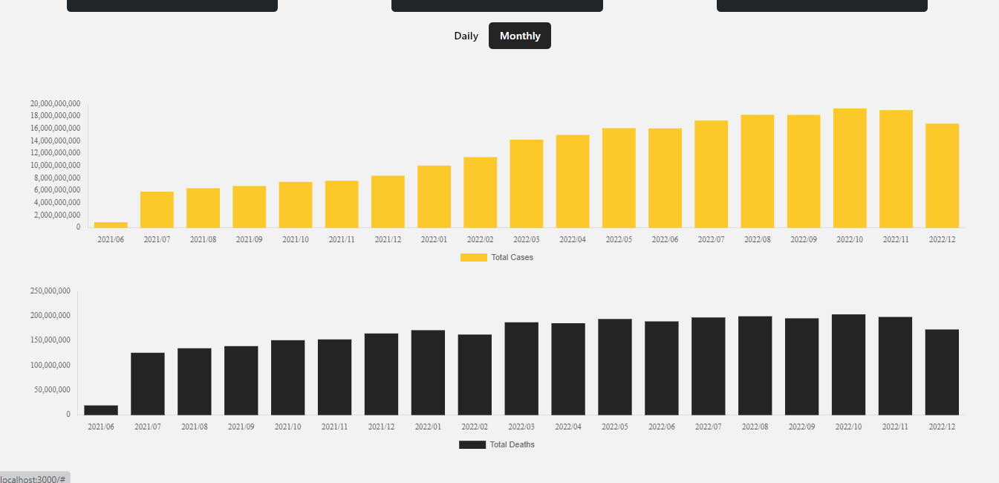
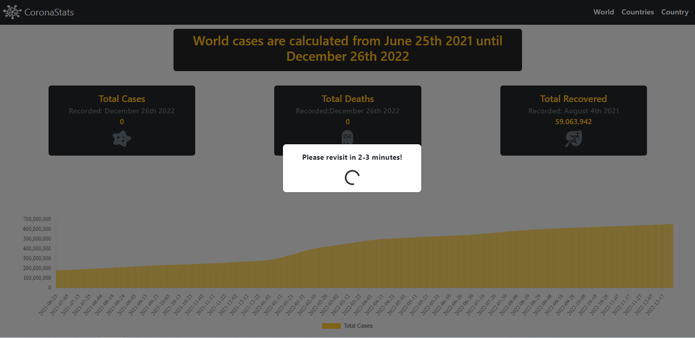
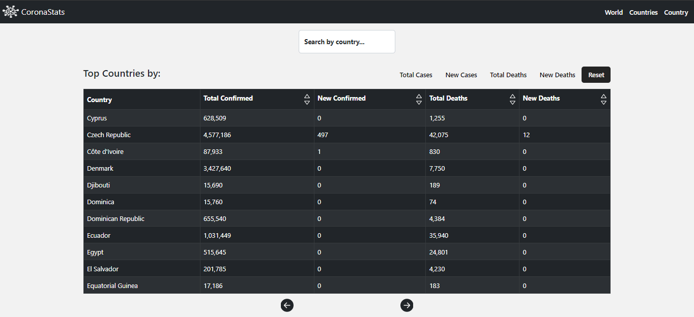
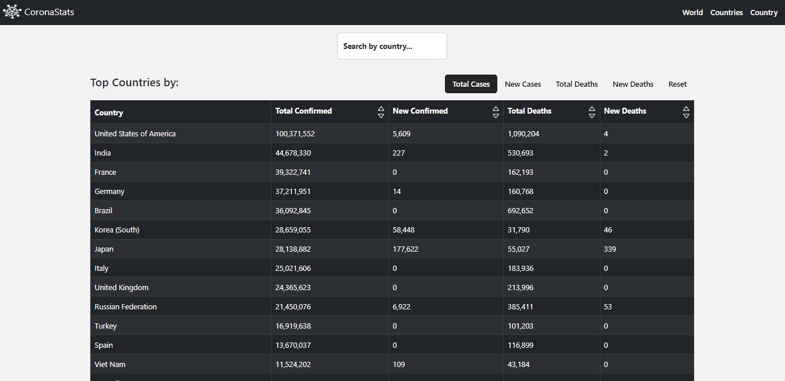
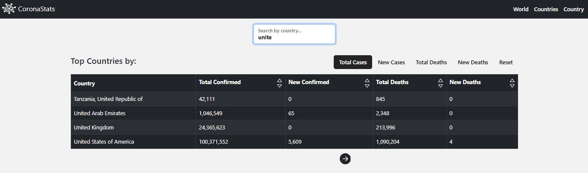
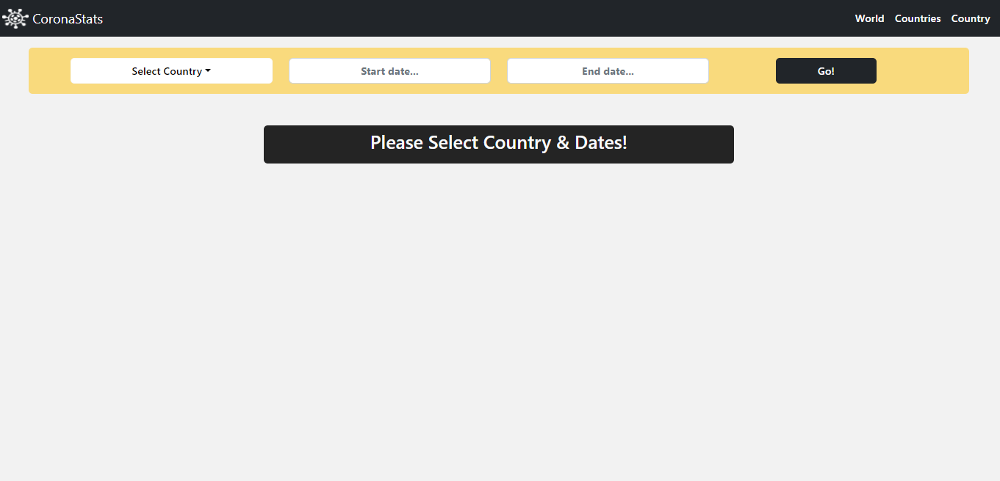
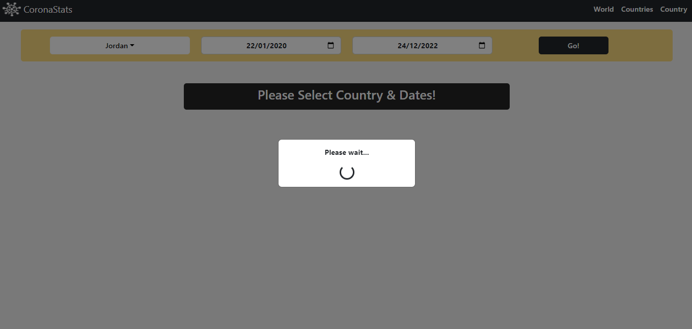
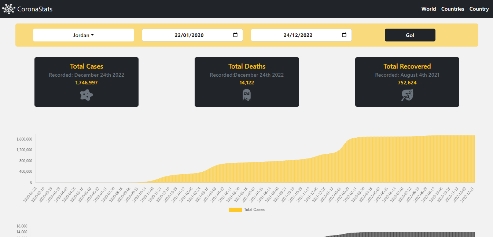
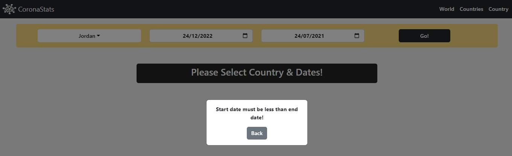

<div  align="center" style ="width=200px ;height=200px;">
</a>
</div >

<h3 align="center">CoronaStats</h3>

---

<p align="center"> An application to keep track of Covid-19 statistics worldwide!
    <br> 
</p>

## Table of Contents

- [About](#about)
- [Getting Started](#getting_started)
- [Usage](#usage)
- [Built Using](#built_using)
- [Live Link](#live_link)

## About <a name = "about"></a>

CoronaStats is an application that enables the user to track and get the virus statics world wide & for each country!
<br></br>
<b>Features:</b>

<li>User can view total world statistics (total cases,total deaths,total recovered) summed up-to-date.</li>
<li>User can view total world statistics (cases & deaths) graphically as bar charts either day-by-day or month-by-month.</li>
<li>User can view and sort the virus statistics by country (total cases,new cases,total deaths & new deaths).</li>
<li>User can search countries statistics for a specific country.</li>
<li>User can view statistics of a specific country (total cases,total deaths,total recovered) summed from the start of the pandemic until the specified end date.</li>
<li>User can view a specific country statistics (cases & deaths) graphically as bar charts based on the entered start & end dates.</li>

## Getting Started <a name = "getting_started"></a>

These instructions will get you a copy of the project up and running on your local machine for development and testing purposes.

### Prerequisites

you need to have the following installed in your machine:

- [VS Code](https://code.visualstudio.com/)
- [Git Bash](https://git-scm.com/downloads)
- [Node JS](https://nodejs.org/en/download/)

### Installing

A step by step series of examples that tell you how to get a development env running.

1. Clone the repo to your local machine git bash.

```sh
git clone https://github.com/HalaNHasan/CoronaStats.git
```

2. Install the needed packages inside the frontend folder

```sh
npm i
```

3.Run application using git bash inside frontend folder.

```sh
npm run start
```

## Usage <a name="usage"></a>

1. World Page

- User can view total world statistics numerically & graphically as bar charts plotted either day-by-day or month-by-month.
<p align="center">
  
  <br></br>
  
</p>
  - Since the total number of cases is updated each 10 minutes;the user might be sometimes unable to navigate the application until the API-update is finished.
  <p align="center">
    
  </p>

2. Countries Page

- User can view and sort the virus statistics by country and navigate between the countries list (arranged alphabetically).
  <p align="center"> 
  
  </p>>

- User can view the virus statistics sorted descendingly either by total cases,new cases,total deaths & new deaths,also the statics can be re-sorted ascendingly by the sorting arrows in the table header.
  <p align="center"> 
  
  </p>

- User can search for the statistics of a specific country.
  <p align="center"> 
  
  </p>

3. Country Page

- User can view a specific country statistics (cases & deaths) numerically & graphically as bar charts based on the entered start & end dates.

  <p align="center"> 
   
    <br></br>
   
    <br></br>
   
    <br></br>
    </p>

- Start date not to be less than January 22nd 2020 (when the statistics started to be recorded),and the end data is set to be less than the current day by two days to ensure that statistcs are fetched correctly.
<p align="center"> 
  
  </p>

## Built Using <a name = "built_using"></a>

- [React JS](https://https://reactjs.org/)

## Live Link <a name = "live_link"></a>

- [CoronaStats](https://nadsoft-task-hala-corona-stats.web.app/)
